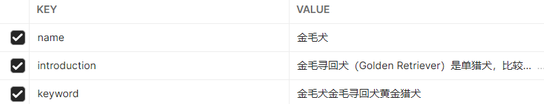

## 返回值说明

返回值为一个json字符,有四部分：

- Code 状态码，只有200表示成功
- Msg 状态码对应的信息
- err 服务端出现的异常
- data 主要响应的数据

## 接口说明

**协议：** ``HTTP``

**API HOST：** ``101.42.38.110/api/v1``

# 登录注册模块

## 发送验证码

**接口：** ``/user/code``

**请求方式：** ``POST``

**请求参数：** 

| 参数名   | 类型     | 备注  |
| ----- | ------ | --- |
| email | string | 邮箱  |

**成功：**

```json
{
    "data": "发送成功",
    "code": 200,
    "msg": "ok",
    "err": null
}
```

**失败：**

```json
{
    "data": null,
    "code": 10001,
    "msg": "邮箱格式不正确",
    "err": null
}
```

## 注册账号

**接口：** ``/user/register``

**请求方式：** ``POST``

**请求参数：**

| 参数名      | 类型     | 备注                                               |
| -------- | ------ | ------------------------------------------------ |
| email    | string | 邮箱                                               |
| code     | int    | 验证码                                              |
| password | string | 密码<br/>要求：<br/>1.长度为8到16<br/>2.必须包含数字和字母，不能有其它字符 |

**成功：**

```json
{
  "data": "注册成功",
  "code": 200,
  "msg": "ok",
  "err": null
}
```

**失败：**

```json
{
  "data": null,
  "code": 10003,
  "msg": "验证码错误",
  "err": null
}
```

```json
{
    "data": null,
    "code": 10004,
    "msg": "该邮箱已经注册",
    "err": null
}
```

## 密码登录

**接口：** ``/user/login/password``

**请求方式：** ``POST``

**请求参数：**

| 参数名      | 类型     | 备注  |
| -------- | ------ | --- |
| email    | string | 邮箱  |
| password | string | 密码  |

**成功：**

```json
{
  "data": {
    "email": "2985496686@qq.com",
    "nickName": "捕蝇草26173ec9001",
    "sex": 0,
    "icon": "",
    "token": "5433e1c4-8cfe-11ed-8f27-38f3ab2900a7"
  },
  "code": 200,
  "msg": "ok",
  "err": null
}
```

**失败：**

```json
{
  "data": null,
  "code": 10005,
  "msg": "账号或密码不正确",
  "err": null
}
```

## 验证码登录

**接口：** ``/user/login/code``

**请求方式：** ``POST``

**请求参数：**

| 参数名   | 类型     | 备注  |
| ----- | ------ | --- |
| email | string | 邮箱  |
| code  | int    | 验证码 |

**成功：**

```json
{
  "data": {
    "email": "2985496686@qq.com",
    "nickName": "捕蝇草26173ec9001",
    "sex": 0,
    "icon": "",
    "token": "25bdf4e0-8cff-11ed-af28-38f3ab2900a7"
  },
  "code": 200,
  "msg": "ok",
  "err": null
}
```

**失败：**

```json
{
  "data": null,
  "code": 10003,
  "msg": "验证码错误",
  "err": null
}
```

## 修改密码

**接口：** ``user/password/:nickName``

**请求方式：** ``PATCH``

**请求参数：**

请求头中需携带token

| 参数名      | 类型     | 备注  |
|----------|--------|-----|
| email    | string | 邮箱  |
| password | int    | 新密码 |


**成功：**
```json
{
 "data": "修改成功,请重新登录",
 "code": 200,
 "msg": "ok",
 "err": null
}
```

**失败：** token错误
```json
{
 "data": null,
 "code": 10007,
 "msg": "用户未登录",
 "err": null
}
```


**失败：** 验证码错误
```json
{
  "data": null,
  "code": 10003,
  "msg": "验证码错误",
  "err": null
}
```


## 退出账号

**接口：** ``user/logout/:nickName``

**请求方式：** ``POST``

**请求参数：**

请求头中需携带token


**成功：**
```json
{
 "data": "退出成功",
 "code": 200,
 "msg": "ok",
 "err": null
}
```

**失败：** 同上


## 上传头像


**接口：** ``user/icon/:nickName``

**请求方式：** ``POST``

**请求参数：**

| 参数名      | 类型     | 备注                                                             |
|----------|--------|----------------------------------------------------------------|
| iconFile | File   | 图片文件 <br/>1. 仅支持png、gif、jpeg、jpg、bmp类型的图片文件 <br/>2.图片大小必须小于2MB |


**成功：返回图片链接**
```json
{
 "data": "http://rnyrwpase.bkt.clouddn.com/FsWaUHXkJ9iJRfrTzLcr5I6YVnsD",
 "code": 200,
 "msg": "ok",
 "err": null
}
```

**失败：**
```json
{
    "data": null,
    "code": 10009,
    "msg": "不支持该格式的图片",
    "err": null
}
```
```json
{
    "data": null,
    "code": 10008,
    "msg": "只允许2MB以下的图片作为头像",
    "err": null
}
```
**其余错误同上，以下凡是需要token验证的均存在此错误，不在赘述**

# 编辑个人信息模块

## 获取自己信息

**接口：** ``userInfo/me/:nickName``

**请求方式：** ``GET``

**请求参数：**

请求头中需携带token


**成功：**
```json
{
 "data": {
  "email": "2985496686@qq.com", 
  "nickName": "独角仙2b4f02829001",
  "icon": "http://rnyrwpase.bkt.clouddn.com/Fp3LECPJ6OKTjOLS3-_-jVnGgohc",
  "address": "",
  "introduction": "",
  "sex": 1,
  "followee": 0,
  "fans": 0,
  "notesNumber": 0,
  "notes": 0
 },
 "code": 200,
 "msg": "ok",
 "err": null
}
```

**data说明**

| 字段名            | 类型     | 备注                         |
|----------------|--------|----------------------------|
| email          | string | 邮箱                         |
| icon           | string | 头像的链接                      |
| address        | string | 地址                         |
| introduction   | string | 个人简介                       |
| sex            | int    | 性别 <br/>默认为2表示未知，0表示男，1表示女 |
| followee       | int    | 关注数                        |
| fans           | int    | 粉丝数                        |
| notesNumber    | int    | 发布的笔记数                     |
| getLikesNumber | int    | 获得的点赞数                     |


## 编辑个人信息

**接口：**  ``userInfo/edit/sex/:nickName`` 、``userInfo/edit/address/:nickName``、``userInfo/edit/introduction/:nickName``

**请求方式：** ``PATCH``

**请求参数：**

请求头中需携带token

| 参数名                      | 类型     | 备注       |
|--------------------------|--------|----------|
| sex/address/introduction | string | 要编辑的个人信息 |

**成功：**
```json
{
    "data": "修改成功",
    "code": 200,
    "msg": "ok",
    "err": null
}
```

# 动植物检索模块

## 管理员接口

### 添加动植物信息
**接口：**  ``pet/admin/petInfo``

**请求方式：** ``POST``

**请求参数：**


| 参数名          | 类型     | 备注    |
|--------------|--------|-------|
| name         | string | 必须唯一  |
| introduction | string | 简介    |
| keyword      | string | 检索关键字 |

例：



### 为动植物添加图片
**接口：**  ``pet/admin/petInfo``

**请求方式：** ``POST``

**请求参数：**


| 参数名     | 类型     | 备注  |
|---------|--------|-----|
| picture | file   | 图片  |
| name    | string | 名字  |


## 关键字搜索

